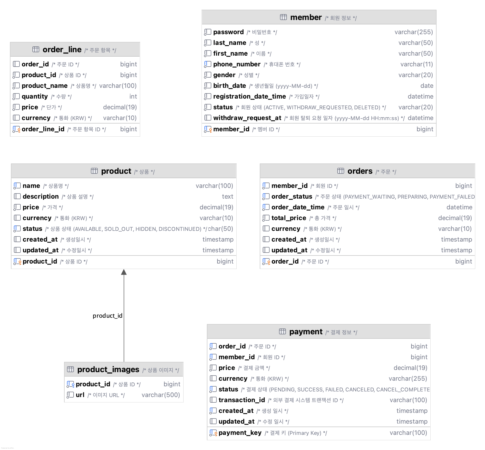

# Cafe Mobile Order System

## 프로젝트 개요

카페 모바일 주문 시스템은 회원이 카페 상품을 모바일로 주문하고 결제할 수 있는 백엔드 서비스입니다.
Spring Boot 기반으로 구축되었으며, 회원 관리와 주문 관리 기능을 제공합니다.

## 파일 위치
API 문서 : API_DOCUMENTATION.md

jar 파일 : cafe-mobile-order-1.0.0.jar

db스키마 : src/main/resources/schema.sql

## 기술 스택

### Backend
- Java 17
- Spring Boot 3.5.7
- Spring Data JPA
- Spring Security
- Spring Validation

### Database
- MySQL 8.0+

### API Documentation
- Swagger/OpenAPI 3.0

### Build Tool
- Gradle 8.x

## 주요 기능

### 1. 회원 관리

#### 1.1 회원 가입
본 모바일 서비스는 회원 가입 후 이용할 수 있습니다.

**필수 입력 정보:**
- **성(lastName)**: 회원의 성
- **이름(firstName)**: 회원의 이름
- **전화번호(phoneNumber)**: 하이픈 포함/미포함 모두 가능 (예: `010-1234-5678` 또는 `01012345678`)
- **성별(gender)**: `MALE`, `FEMALE`, `OTHER` 중 선택
- **생년월일(birthDate)**: `yyyy-MM-dd` 형식 (예: `1990-01-01`)
- **비밀번호(password)**: 8~20자의 영문자, 숫자, 특수문자(!@#$%?) 포함

**비즈니스 규칙:**
- 전화번호는 중복될 수 없습니다
- 회원 가입 시 비밀번호는 암호화되어 저장됩니다
- 가입 완료 시 회원 상태는 `ACTIVE`로 설정됩니다

**API 엔드포인트:**
```
POST /members/signup
Content-Type: application/json

{
  "lastName": "김",
  "firstName": "철수",
  "phoneNumber": "010-1234-5678",
  "gender": "MALE",
  "birthDate": "1990-01-01",
  "password": "password123!@#"
}
```

#### 1.2 회원 탈퇴
더 이상 서비스 이용을 원하지 않는 경우를 위해 회원 탈퇴 기능을 제공합니다.

**비즈니스 규칙:**
- 탈퇴 요청 시 회원 상태가 `WITHDRAW_REQUESTED`로 변경됩니다
- 탈퇴 요청 일시(`withdrawRequestedAt`)가 기록됩니다
- 탈퇴한지 30일 이내에는 탈퇴를 철회할 수 있습니다
- 탈퇴 철회 시 즉시 서비스 이용이 가능합니다 (상태가 `ACTIVE`로 복구)
- 30일 경과 후에는 회원 상태가 `DELETED`로 변경됩니다

**자동 비활성화 배치 작업:**

시스템은 정기적으로 탈퇴 요청 후 30일이 경과한 회원들을 자동으로 비활성화합니다.

```java
@Transactional
public void deactivateExpiredWithdrawnMembers() {
    LocalDateTime deadline = LocalDateTime.now().minusDays(30);
    int deactivatedCount = memberRepository.bulkDeactivate(deadline, MemberStatus.WITHDRAW_REQUESTED);

    log.info("deactivateExpiredWithdrawnMembers : deactivatedCount = {}", deactivatedCount);
}
```

- `WITHDRAW_REQUESTED` 상태인 회원 중 탈퇴 요청일(`withdrawRequestedAt`)이 30일 이전인 회원을 조회
- 해당 회원들의 상태를 `DELETED`로 일괄 변경
- 변경된 회원 수를 로그로 기록

**회원 상태(MemberStatus):**
- `ACTIVE`: 정상 활성 회원
- `WITHDRAW_REQUESTED`: 탈퇴 요청 상태 (30일 이내 철회 가능)
- `DELETED`: 완전 탈퇴 (30일 경과 후)

### 2. 상품 주문 및 주문 취소

#### 2.1 상품 주문
회원은 원하는 상품을 골라 주문할 수 있습니다.

**주문 프로세스:**
1. 회원이 주문할 상품과 수량을 선택합니다
2. 주문 요청 시 결제가 자동으로 진행됩니다
3. 결제가 성공하면 주문이 완료됩니다
4. 결제가 실패하면 주문이 자동으로 취소됩니다
5. 실패 주문은 status :  PAYMENT_FAILED로 반환됩니다.

**결제 처리 흐름:**

주문 생성 시 결제는 외부 결제 시스템과 연동하여 처리됩니다.

```java
// OrderService.placeOrder() 내부 결제 처리 로직
// 1. Order 생성 및 저장 (ID 생성)
Order savedOrder = orderRepository.save(order);

// 2. 결제 처리 (외부 결제 시스템 호출)
boolean paymentSuccess = paymentPort.processPayment(
    savedOrder.getOrderId(),
    savedOrder.getMemberId(),
    savedOrder.getTotalPrice()
);

// 3. 결제 결과에 따른 처리
if (paymentSuccess) {
    savedOrder.completePayment();  // 주문 상태: PREPARING
} else {
    savedOrder.failPayment();      // 주문 실패 처리
}
```

**결제 세부 처리 과정:**
1. **결제 생성**: Payment 엔티티 생성 (상태: `PENDING`, 고유 PaymentKey 발급)
2. **외부 결제 시스템 호출**: PaymentClient를 통해 실제 결제 진행
   - 회원 정보(이름, 생년월일, 전화번호)와 결제 금액 전송
3. **결제 결과 처리**:
   - 성공 시: Payment 상태 → `SUCCESS`, Order 상태 → `PREPARING`
   - 실패 시: Payment 상태 → `FAILED`, Order 실패 처리
4. **결제 정보 저장**: Payment 엔티티 영속화

**비즈니스 규칙:**
- 주문 금액은 각 상품의 가격 × 수량의 합계로 계산됩니다
- 결제는 별도 트랜잭션(`REQUIRES_NEW`)으로 처리되어 독립적으로 관리됩니다
- 주문 완료 시 주문 상태는 `PREPARING`(준비 중)으로 설정됩니다

**결제 상태(PaymentStatus):**
- `PENDING`: 결제 대기 중
- `SUCCESS`: 결제 성공
- `FAILED`: 결제 실패
- `CANCELED`: 결제 취소 등록 (외부 시스템 취소 대기)
- `CANCEL_COMPLETED`: 결제 취소 완료

**주문 상태(OrderStatus):**
- `PAYMENT_WAITING`: 결제 대기 중
- `PREPARING`: 준비 중
- `COMPLETED`: 완료
- `CANCELED`: 취소됨

**API 엔드포인트:**
```
POST /orders
Content-Type: application/json

{
  "memberId": 1,
  "orderLines": [
    {
      "productId": 1,
      "quantity": 2
    },
    {
      "productId": 2,
      "quantity": 1
    }
  ]
}
```

**응답 예시:**
```json
{
  "orderId": 1,
  "memberId": 1,
  "orderStatus": "PREPARING",
  "orderDateTime": "2025-11-05T14:30:00",
  "totalPrice": 15000,
  "currency": "KRW",
  "orderLines": [
    {
      "orderLineId": 1,
      "productId": 1,
      "productName": "아메리카노",
      "quantity": 2,
      "price": 4500
    },
    {
      "orderLineId": 2,
      "productId": 2,
      "productName": "카페라떼",
      "quantity": 1,
      "price": 6000
    }
  ]
}
```

#### 2.2 주문 조회

**단건 조회:**
```
GET /orders/{orderId}
```

**전체 조회 (페이징):**
```
GET /orders?page=0&size=20
```

**회원별 조회:**
```
GET /orders/members/{memberId}
```

#### 2.3 상품 주문 취소
회원은 주문한 상품을 취소할 수 있습니다.

**비즈니스 규칙:**
- 본인의 주문만 취소할 수 있습니다 (memberId 검증)
- 주문 취소 시 결제 내역도 함께 취소됩니다
- 서빙 중(`PREPARING`)이거나 완료된(`COMPLETED`) 주문은 취소할 수 없습니다
- 이미 취소된 주문은 다시 취소할 수 없습니다

**API 엔드포인트:**
```
POST /orders/{orderId}/cancel
Content-Type: application/json

{
  "memberId": 1
}
```

**취소 프로세스:**
1. 주문 상태 검증 (취소 가능 여부 확인)
2. 주문자 본인 확인 (memberId 일치 여부)
3. 결제 취소 처리
4. 주문 상태를 `CANCELED`로 변경

**결제 취소 처리 흐름:**

주문 취소 시 결제 취소는 2단계로 처리됩니다.

```java
// OrderService.cancelOrder() 내부 결제 취소 로직
// 1. 결제 취소 등록 (동기 처리)
paymentPort.cancelPayment(orderId);

// 2. 비동기 배치 작업으로 외부 결제 시스템 취소 처리
```

**결제 취소 세부 처리 과정:**

**1단계: 결제 취소 등록 (즉시 처리)**
```java
@Transactional
public PaymentInfoResponse cancelPayment(Long orderId) {
    Payment payment = paymentRepository.findByOrderId(orderId)
        .orElseThrow(() -> new CommonException(...));

    // 결제 상태를 CANCELED로 변경
    payment.markAsCanceled();
    paymentRepository.save(payment);

    return PaymentInfoResponse.of(...);
}
```

- Payment 엔티티의 상태를 `CANCELED`로 변경
- 주문 즉시 취소 등록 완료

**2단계: 외부 결제 시스템 취소 (비동기 배치 처리)**
```java
@Async("asyncExecutor")
@Transactional(propagation = REQUIRES_NEW)
public void processSingleCanceledPaymentAsync(String paymentKey) {
    Payment payment = paymentRepository.findByPaymentKey(paymentKey)
        .orElseThrow(...);

    // CANCELED 상태인 결제만 처리
    if (payment.getStatus() != PaymentStatus.CANCELED) {
        return;
    }

    // 외부 결제 시스템에 취소 요청
    CompletableFuture<PaymentResponse> cancelResponse = paymentClient.cancel(paymentKey);

    if (cancelResponse.get().success()) {
        // 외부 취소 성공 시 CANCEL_COMPLETED로 변경
        payment.markAsCancelCompleted();
        paymentRepository.save(payment);
    }
}
```

- 스케줄러가 주기적으로 `CANCELED` 상태인 결제 건을 조회 (현재 1분으로 설정)
- 비동기로 외부 결제 시스템(PaymentClient)에 취소 요청
- 취소 성공 시 Payment 상태를 `CANCEL_COMPLETED`로 변경
- 독립된 트랜잭션(`REQUIRES_NEW`)으로 처리되어 개별 실패해도 다른 취소 건에 영향 없음

**결제 취소 처리 방식 선택 이유:**
- **즉시 응답**: 사용자는 주문 취소 요청 후 즉시 응답을 받음
- **비동기 처리**: 외부 결제 시스템 지연/장애 시에도 사용자 경험에 영향 없음
- **재처리 가능**: 외부 시스템 취소 실패 시 배치 작업으로 재시도 가능
- **안정성**: 각 결제 건이 독립된 트랜잭션으로 처리되어 안정적

## 데이터베이스 스키마



### Member (회원)
```sql
member_id           BIGINT PK AUTO_INCREMENT  -- 회원 ID
password            VARCHAR(255)              -- 암호화된 비밀번호
last_name           VARCHAR(50)               -- 성
first_name          VARCHAR(50)               -- 이름
phone_number        VARCHAR(11) UNIQUE        -- 전화번호
gender              VARCHAR(20)               -- 성별
birth_date          DATE                      -- 생년월일
registration_date_time DATETIME               -- 가입일시
status              VARCHAR(20)               -- 회원 상태
withdraw_request_at DATETIME                  -- 탈퇴 요청 일시
```

### Order (주문)
```sql
order_id            BIGINT PK AUTO_INCREMENT  -- 주문 ID
member_id           BIGINT                    -- 회원 ID
order_status        VARCHAR(50)               -- 주문 상태
order_date_time     DATETIME                  -- 주문 일시
total_price         DECIMAL(19,0)             -- 총 금액
currency            VARCHAR(10)               -- 통화
created_at          TIMESTAMP                 -- 생성일시
updated_at          TIMESTAMP                 -- 수정일시
```

### OrderLine (주문 항목)
```sql
order_line_id       BIGINT PK AUTO_INCREMENT  -- 주문 항목 ID
order_id            BIGINT FK                 -- 주문 ID
product_id          BIGINT                    -- 상품 ID
product_name        VARCHAR(100)              -- 상품명
quantity            INT                       -- 수량
price               DECIMAL(19,0)             -- 단가
currency            VARCHAR(10)               -- 통화
```

### Product (상품)
```sql
product_id          BIGINT PK AUTO_INCREMENT  -- 상품 ID
name                VARCHAR(100)              -- 상품명
description         TEXT                      -- 상품 설명
price               DECIMAL(19,0)             -- 가격
currency            VARCHAR(10)               -- 통화
status              VARCHAR(50)               -- 상품 상태
created_at          TIMESTAMP                 -- 생성일시
updated_at          TIMESTAMP                 -- 수정일시
```

### Payment (결제)
```sql
payment_key         VARCHAR(100) PK           -- 결제 키
order_id            BIGINT                    -- 주문 ID
member_id           BIGINT                    -- 회원 ID
price               DECIMAL(19,0)             -- 결제 금액
currency            VARCHAR(255)              -- 통화
status              VARCHAR(20)               -- 결제 상태
transaction_id      VARCHAR(100)              -- 외부 결제 트랜잭션 ID
created_at          TIMESTAMP                 -- 생성일시
updated_at          TIMESTAMP                 -- 수정일시
```

## 프로젝트 구조

```
ys.cafe (src/main/java)
├── CafeApplication
├── common
│   ├── config
│   ├── event
│   ├── exception
│   │   └── errorcode
│   └── util
├── member
│   ├── common
│   ├── controller
│   ├── domain
│   │   └── vo
│   ├── exception
│   │   └── errorcode
│   ├── persistence
│   └── service
│       └── dto
│           ├── request
│           └── response
├── order
│   ├── controller
│   ├── domain
│   │   └── vo
│   ├── exception
│   │   └── errorcode
│   ├── out
│   │   ├── adapter
│   │   └── port
│   ├── repository
│   ├── service
│   │   └── dto
│   └── util
├── payment
│   ├── common
│   ├── config
│   ├── controller
│   ├── domain
│   │   └── vo
│   ├── exception
│   ├── out
│   │   ├── adapter
│   │   └── port
│   ├── repository
│   └── service
│       └── dto
│           ├── request
│           └── response
└── product
    ├── common
    ├── controller
    ├── domain
    │   └── vo
    ├── exception
    │   └── errorcode
    ├── repository
    └── service
    └── dto

ys.cafe (src/test/java)
├── common
│   └── vo
├── member
│   ├── controller
│   ├── domain
│   │   └── vo
│   ├── objectmother
│   └── service
├── order
│   ├── controller
│   ├── domain
│   ├── objectmother
│   └── service
├── payment
│   ├── controller
│   ├── domain
│   └── service
└── product
    ├── controller
    ├── domain
    └── service
```

## 설치 및 실행

### 사전 요구사항
- JDK 17 이상
- MySQL 8.0 이상
- Gradle 8.x 이상

### 데이터베이스 설정

1. MySQL에 데이터베이스를 생성합니다:
```sql
CREATE DATABASE cafe-order CHARACTER SET utf8mb4 COLLATE utf8mb4_unicode_ci;
```

2. `src/main/resources/application.yml` 파일을 확인하고 필요시 데이터베이스 접속 정보를 수정합니다:
```yaml
spring:
  datasource:
    url: jdbc:mysql://localhost:3306/cafe-order?useSSL=false&serverTimezone=Asia/Seoul&characterEncoding=UTF-8
    username: root
    password: 1234
```

3. 스키마를 생성합니다:
```bash
mysql -u root -p cafe-order < src/main/resources/schema.sql
```

### 애플리케이션 실행

#### Gradle을 사용한 실행
```bash
# 빌드
./gradlew clean build

# 테스트
./gradlew test

# 실행
./gradlew bootRun
```

#### JAR 파일로 실행
```bash
./gradlew bootJar
java -jar build/libs/cafe-mobile-order-1.0.0.jar
```

### API 문서 확인

애플리케이션 실행 후 다음 URL에서 Swagger UI를 통해 API 문서를 확인할 수 있습니다:

```
http://localhost:8080/swagger-ui.html
```

## 테스트

### 테스트 프레임워크 및 라이브러리

- **JUnit 5**: JUnit 사용한 테스트 작성
- **Mockito**: Mock 기반 단위 테스트
- **AssertJ**: 유창한(Fluent) API를 제공하는 단언 라이브러리
- **Spring Test**: MockMvc를 사용한 컨트롤러 계층 테스트

### 테스트 계층 구조

프로젝트는 계층별로 테스트를 작성하여 각 계층의 책임을 독립적으로 검증합니다:

#### 1. Value Object 테스트
도메인의 핵심 값 객체에 대한 철저한 유효성 검증 테스트

**테스트 대상**:
- `PhoneNumber`: 전화번호 형식 검증 및 정규화
- `Password`: 비밀번호 강도 검증
- `BirthDate`: 생년월일 유효성 검증
- `Won`: 금액 계산 및 검증
- `Name`: 이름 검증

**테스트 예시** (`PhoneNumberTest.java`):
```java
@DisplayName("PhoneNumber Value Object 테스트")
class PhoneNumberTest {

    @Nested
    @DisplayName("PhoneNumber 생성 성공 테스트")
    class CreatePhoneNumberSuccessTest {

        @Test
        @DisplayName("유효한 11자리 숫자로 전화번호를 생성할 수 있다")
        void createPhoneNumberWithValidInput() {
            // given
            String phoneNumber = "01012345678";

            // when
            PhoneNumber result = PhoneNumber.of(phoneNumber);

            // then
            assertThat(result).isNotNull();
            assertThat(result.getValue()).isEqualTo("01012345678");
        }
    }

    @Nested
    @DisplayName("PhoneNumber 생성 실패 테스트")
    class CreatePhoneNumberFailTest {

        @ParameterizedTest
        @ValueSource(strings = {"0101234567", "010123456789", "010-abcd-5678"})
        @DisplayName("유효하지 않은 형식은 예외가 발생한다")
        void createPhoneNumberWithInvalidFormat(String phoneNumber) {
            // when & then
            assertThatThrownBy(() -> PhoneNumber.of(phoneNumber))
                .isInstanceOf(MemberValidationException.class);
        }
    }
}
```

#### 2. Domain 테스트
도메인 엔티티의 비즈니스 로직 및 상태 변화 검증

**테스트 대상**:
- `Member`: 회원 가입, 탈퇴, 철회 로직
- `Order`: 주문 생성, 취소, 상태 변경 로직
- `Payment`: 결제 처리, 취소 로직
- `Product`: 상품 생성, 상태 관리 로직

**주요 검증 사항**:
- 도메인 규칙 준수 여부
- 상태 전이의 유효성
- 비즈니스 제약 사항

#### 3. Service 테스트 (단위 테스트)
비즈니스 로직을 Mock을 사용하여 격리된 환경에서 테스트

**테스트 패턴**:
```java
@ExtendWith(MockitoExtension.class)
class MemberServiceTest {

    @InjectMocks
    private MemberService memberService;

    @Mock
    private MemberRepository memberRepository;

    @Mock
    private PasswordEncoder passwordEncoder;

    @Test
    @DisplayName("유효한 정보로 회원가입을 할 수 있다")
    void signUpWithValidInfo() {
        // given
        MemberSignUpRequest request = new MemberSignUpRequest(...);
        when(memberRepository.findOneByPhoneNumber(any())).thenReturn(Optional.empty());
        when(passwordEncoder.encode(anyString())).thenReturn("encoded");

        // when
        MemberResponse response = memberService.signUp(request);

        // then
        assertThat(response).isNotNull();
        assertThat(response.name().fullName()).isEqualTo("김철수");
        verify(memberRepository).save(any(Member.class));
    }
}
```

**주요 테스트 시나리오**:
- **회원 서비스**: 회원가입, 중복 검증, 탈퇴/철회
- **주문 서비스**: 주문 생성, 결제 연동, 주문 취소, 회원 상태 검증
- **결제 서비스**: 결제 처리, 결제 취소, 스케줄러 작업
- **상품 서비스**: 상품 CRUD, 상태 관리

#### 4. Controller 테스트 (통합 테스트)
API 엔드포인트 및 요청/응답 검증

**테스트 패턴**:
```java
@ExtendWith(SpringExtension.class)
public class MemberControllerTest {

    private MockMvc mockMvc;

    @Mock
    private MemberService memberService;

    @BeforeEach
    public void setUp() {
        memberController = new MemberController(memberService);
        mockMvc = MockMvcBuilders
            .standaloneSetup(memberController)
            .setControllerAdvice(globalExceptionHandler)
            .build();
    }

    @Test
    @DisplayName("유효한 요청으로 회원가입을 할 수 있다")
    public void signUpMember() throws Exception {
        // given
        MemberSignUpRequest request = createRequest(...);

        // when & then
        mockMvc.perform(
            post("/members/signup")
                .contentType(MediaType.APPLICATION_JSON)
                .content(objectMapper.writeValueAsString(request))
        )
        .andExpect(status().isCreated())
        .andExpect(jsonPath("$.name.fullName").value("김철수"))
        .andExpect(jsonPath("$.phoneNumber.formatted").value("010-1234-5678"));
    }
}
```

**검증 사항**:
- HTTP 상태 코드
- 응답 JSON 구조 및 값
- 입력 유효성 검증
- 예외 처리 및 에러 응답

### 테스트 작성 원칙

#### 1. BDD 스타일 (Given-When-Then)
모든 테스트는 BDD 스타일로 작성하여 가독성을 높입니다:

```java
@Test
void testName() {
    // given - 테스트 준비 (데이터 설정)

    // when - 테스트 실행 (메서드 호출)

    // then - 결과 검증 (단언문)
}
```

#### 2. @Nested를 활용한 테스트 그룹화
관련된 테스트들을 논리적으로 그룹화하여 구조화:

```java
@DisplayName("PhoneNumber 테스트")
class PhoneNumberTest {

    @Nested
    @DisplayName("생성 성공 테스트")
    class CreateSuccessTest { ... }

    @Nested
    @DisplayName("생성 실패 테스트")
    class CreateFailTest { ... }
}
```

#### 3. @DisplayName을 사용한 명확한 테스트 설명
한글로 테스트 의도를 명확하게 표현:

```java
@DisplayName("유효한 11자리 숫자로 전화번호를 생성할 수 있다")
void createPhoneNumberWithValidInput() { ... }
```

#### 4. Parameterized Test 활용
여러 입력값에 대해 동일한 검증을 수행:

```java
@ParameterizedTest
@ValueSource(strings = {"0101234567", "010123456789", "010-abcd-5678"})
@DisplayName("유효하지 않은 전화번호는 예외가 발생한다")
void createPhoneNumberWithInvalidFormat(String phoneNumber) {
    assertThatThrownBy(() -> PhoneNumber.of(phoneNumber))
        .isInstanceOf(MemberValidationException.class);
}
```

#### 5. ObjectMother 패턴
테스트 데이터 생성을 위한 헬퍼 클래스 사용:

```java
// ObjectMother 클래스
public class MemberMother {
    public static Member getRegisterMember() {
        return Member.register(
            "Password123!",
            "김", "철수",
            "010-1234-5678",
            "MALE",
            "1990-01-01",
            s -> s + "encoded"
        );
    }
}

// 테스트에서 사용
Member member = MemberMother.getRegisterMember();
```

#### 6. AssertJ를 활용한 검증
가독성 높은 검증문 작성:

```java
assertThat(response)
    .isNotNull()
    .extracting("name", "phoneNumber", "status")
    .containsExactly("김철수", "01012345678", "ACTIVE");

assertThat(response.orders())
    .hasSize(2)
    .extracting("orderId")
    .containsExactly(1L, 2L);
```

### 테스트 실행

#### 전체 테스트 실행
```bash
./gradlew test
```

#### 특정 테스트 클래스 실행
```bash
./gradlew test --tests "ys.cafe.member.service.MemberServiceTest"
```

#### 특정 테스트 메서드 실행
```bash
./gradlew test --tests "ys.cafe.member.service.MemberServiceTest.signUpWithValidInfo"
```

#### 테스트 리포트 확인
테스트 실행 후 다음 위치에서 HTML 리포트를 확인할 수 있습니다:
```
build/reports/tests/test/index.html
```

### 테스트 커버리지

프로젝트는 다음 계층에 대한 포괄적인 테스트를 포함합니다:

- **Value Object**: 100% 커버리지 목표 (모든 경계값 및 예외 케이스 검증)
- **Domain**: 핵심 비즈니스 로직 및 상태 전이 검증
- **Service**: 비즈니스 시나리오별 단위 테스트
- **Controller**: API 계약 및 입력 유효성 검증


## 주요 설계 원칙

### 1. 도메인 주도 설계 (DDD)
- 회원(Member), 주문(Order), 주문 항목(OrderLine) 등 명확한 도메인 모델 정의
- Value Object를 활용한 도메인 로직 캡슐화 (PhoneNumber, Won, Quantity 등)
- 비즈니스 규칙을 도메인 객체 내부에 구현

### 2. 계층화 아키텍처
- Controller: API 엔드포인트 및 요청/응답 처리
- Service: 비즈니스 로직 처리
- Domain: 핵심 비즈니스 규칙 및 도메인 모델
- Repository: 데이터 영속성 관리

### 3. 포트와 어댑터 패턴
- out/port: 외부 서비스 인터페이스 정의 (PaymentPort, ProductPort)
- out/adapter: 외부 서비스 구현체 (PaymentPortAdapter, ProductPortAdapter)
- 외부 의존성을 추상화하여 테스트 용이성 및 유지보수성 향상

### 4. 검증 및 예외 처리
- Validation을 활용한 입력 검증
- 커스텀 예외를 통한 비즈니스 오류 처리
- 전역 예외 핸들러를 통한 일관된 오류 응답


